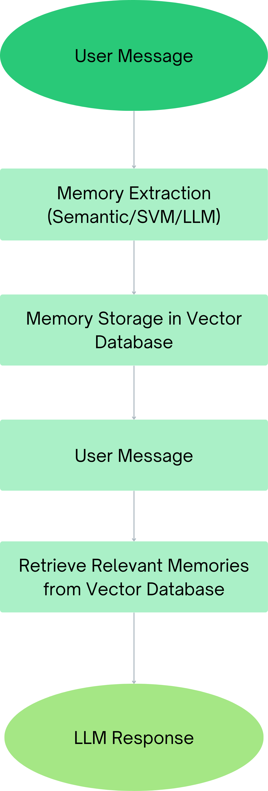

# Memory Extraction Chatbot
A modular memory-augmented chatbot framework comparing semantic, supervised machine-learning, and LLM-based memory extraction under baseline and conflict-aware memory management 
architectures.


# App Demo


[Explore Interactive App Here](https://memory-extraction-chatbot-kgvrscdlmwj9lrh6e9sjtc.streamlit.app/)


# Overview


The Memory Extraction Chatbot is an end-to-end conversational AI system that explores how different memory extraction techniques influence long--term personalization in LLM-powered conversational agents. 


Rather than storing every user input message as a memory indiscriminately, the chatbot predicts which user messages are important enough to retain as long-term memory. Three extraction strategies are compared:


. Semantic Similarity

. Support Vector Machine (SVM)

. Large Language Model (LLM)


The project also compares two memory architectures:


.**Baseline Memory** - appends new memories without discretion beyond importance score

.**Conflict-Aware Memory** - detects and updates contradictory memories


Together, these experiments evaluate how memory extraction and memory management affect the chatbot's ability to retain accurate long-term user information.

# Key Features

. End-to-end conversational AI pipeline

.Modular object-oriented chatbot framework

. Three memory extraction approaches

. Conflict-aware memory updates

. Vector database retrieval through Pinecone

. OpenAI GPT integration

. Interactive Streamlit dashboard

. Memory replay visualization

. User-chatbot interaction interface

. Quantitative evaluation of memory state and retrieval accuracy


## Technologies

. OpenAI API

.Pinecone

. Stramlit

. scikit-learn

. sentence-transformers

. Hugging Face Transformers

. pandas

. NumPy


# System Architecture





The user inputs a message. The chatbot then determines the importance score of the message. There are 5 categories that each correlate with an importance score. They are:


. **5** - critical constraints (severe food allergies, crucial medical information, etc.)

. **4** - stable preference/goal (favorite foods, favorite places, etc.)

. **3** - recurrent context (recurring appointments, schedule related, etc.)

. **2** - temporary context (upcoming trip, etc.)

. **1** - do not store (e.g. "how are you?")


Messages assigned an importance score greater than 1 are embedded using OpenAI's text embedding model (1,536-dimensional vectors) and stored in Pinecone. In future conversations, semantically relevant memories are retrieved from the vector database and incorporated into the GPT's response generation, allowing the chatbot to maintain personalized long-term context. 

Once the importance score is determined to be above a 1, the memory is stored. The message gets embedded as a vector of dimension 1,536 (standard for OpenAI embeddings) and stored in Pinecone. This memory is then accessible for the chatbot in formulating future responses (GPT response generation) if a user references something related to their previous message. 


# Memory Extraction Methods


## Semantic Similarity

User input gets embedded into vector space using OpenAI embeddings. Cosine similarity is used to retrieve top-k most similar labeled examples in the training dataset (containing 200 examples of each category), the importance scores of those top k-data points are weighted based on similarity score, and the weighted importance score is used as the predicted importance score for the user input message. If the weighted importance score is above a 1, the memory gets stored in Pinecone. 


## SVM


SVM model is trained on training dataset to predict importance score of user input message (training data examples are labeled with importance score). Supervised machine learning approach serves as traditional machine learning baseline for comparison against semantic similarity and LLM-based extraction.


## LLM

GPT is prompted with structured set of extraction instructions describing each importance category. The model returns a JSON object containing the predicted importance score and extracted memory, allowing the chatbot to convert unstructured conversation into structured long-term memory to be upserted to Pinecone. 

# Conflict Handling


Part of this project is dedicated to the handling of conflicting memories. For example, if a user inputs that their favorite color is red, that message will likely be labeled as importance score 4 (stable preference/goal) and upserted to Pinecone as a vector and future memory to reference in conversation. If in the same conversation the user later inputs that their favorite color is blue, in the baseline model of the chatbot, that message will also get stored in the vector database. The issue then becomes, however, how should the chatbot handle the question "what is my favorite color" when asked by the user. In the baseline model, it is likely that the chatbot will reference both colors when asked the question. The conflict-aware chatbot model, however, handles the problem differently. 


In the conflict-aware chatbot architecture, when a user inputs a message, which then gets embedded as a vector, before the chatbot assigns the message an importance score, it first retrieves the top-k most similar messages already stored in Pinecone. Once those related memories are retrieved, the LLM is given a very strict rubric to classify the memory as either:

. **Compatible** - poses no conflict to the incoming message

. **Unrelated** - poses no conflict to the incoming message

. **Duplicate** - same semantic meaning as the incoming message

. **Conflict** - at odds with incoming message (i.e. red v. blue)


Once the LLM classifies the related memory, one of the following happens. If it is compatible or unrelated to the incoming message, the incoming message gets stored to the database. If it is a duplicate memory, the incoming message does not get stored. And most importantly, if it is a conflict memory, the conflicting related memory gets deleted from Pinecone and replaced with the new one. So, in practice, "my favorite color is red" will be deleted and replaced by "my favorite color is red." This is done with the intention of increasing the quality of the chatbot response when asked about a topic where the user has at some point or other in the chat input information that conflicts with information input prior. 

Below is a diagram highlighting the pipeline of the conflict-aware architecture. 


# Evaluation 


The chatbots were evaluated under two primary metrics: memory-state accuracy and retrieval accuracy. Memory-state accuracy refers to whether the memory extracted by the chatbot when given a message matches the expected extracted memory. Retrieval accuracy assesses whether the chatbot response contains the appropriate information and excludes any outdated information. These accuracies were evaluated based on the presence of required keywords and absence of defined forbidden words. 


It was found that for memory-state accuracy, the SVM conflict-aware bot surpassed the SVM baseline bot with 46.2% accuracy versus 38.5% accuracy. The semantic-similarity baseline model interestingly outperformed the conflict-aware model with an accuracy of 69.2% as opposed to 61.5%. For the LLM models, it proved that the typical method of evaluation using keywords was not applicable, as the LLM often converted a message from the user such as "I am happy" to "the user is happy" when storing. A project improvement would include developing a tailored method for evaluating LLM memory-state accuracy.


For retrieval accuracy, for the semantic and LLM models, the conflict-aware versions increased accuracy from baseline from 60.0% to 80.0%. For the SVM model, accuracy for both the baseline and conflict-aware architectures was 80%, indicating the SVM model as a strong performer by way of retrieval. 


# Streamlit Application


This project includes an interactive application where users may interact with the chatbot and view memory-processing details for each message input, can use an interactive retrieval demo, and can view all evaluation metrics. A link to the application is included below. 


[Explore Interactive App Here](https://memory-extraction-chatbot-kgvrscdlmwj9lrh6e9sjtc.streamlit.app/)


## Repository Structure

```text
Memory-Extraction-Chatbot/
│
├── app.py
│   Streamlit application and user interface.
│
├── baseline_memory_chatbot.py
│   Baseline memory architecture.
│
├── conflict_memory_chatbot.py
│   Conflict-aware memory architecture.
│
├── evaluation_functions.py
│   Evaluation utilities and retrieval pipeline.
│
├── evaluation_datasets.py
│   Benchmark conversations and evaluation data.
│
├── evaluation_results.py
│   Scripts for generating evaluation metrics.
│
├── config.py
│   API configuration and environment variables.
│
├── prompt.py
│   System prompts used by the chatbot.
│
├── schemas.py
│   Structured JSON schemas for memory extraction.
│
├── data/
│   Training, validation, testing, and benchmark datasets.
│
├── models/
│   Trained machine learning classifiers.
│
└── images/
    Figures and screenshots used in the README.
```text


## Running Locally

### 1. Clone the repository

```bash
git clone https://github.com/YOUR-USERNAME/Memory-Extraction-Chatbot.git
cd Memory-Extraction-Chatbot
```

### 2. Install dependencies

Install all required Python packages:

```bash
pip install -r requirements.txt
```

### 3. Configure API Keys

Create a `.env` file in the project root containing your API credentials:

```text
OPENAI_API_KEY=your_openai_api_key
PINECONE_API_KEY=your_pinecone_api_key
```

The application will automatically load these environment variables at runtime.

### 4. Launch the application

Start the Streamlit application:

```bash
streamlit run app.py
```

The application will open automatically in your default web browser. If it does not, navigate to:

```
http://localhost:8501
```

# Future Improvements


. BERTScore evaluation

. Human Evaluation

. Hybrid memory extraction

. Larger datasets

. Fine-tuned classifier

. Multi-session memory

. Memory expiration
